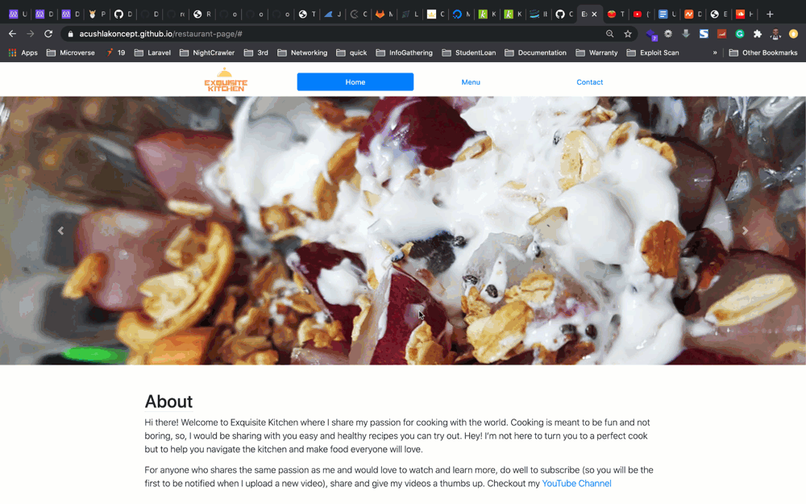

# Buggy Restaurant

This a Simple Restuarant Page App using webpack to manipulate DOM by dynamically rendering its various pages: Home, Menu, and Contact. 

Below you can see how this website should look and behave:

## Why this Restaurant page is special?

Buggy Restaurant is unique as it will serve you not only delicious food but also a couple of bugs 🐛🐛.
This project is supposed to be used in the "Catch hidden bugs" exercise.

## Built With

- HTML
- JavaScript
- BootStrap

## Author

The author of the entire code is Uduak Essien - [acushlakoncept](https://github.com/acushlakoncept).

## Acknowledgements

Thank you [acushlakoncept](https://github.com/acushlakoncept) for preparing this code - in its perfect and also bugged version! 👏👏👏